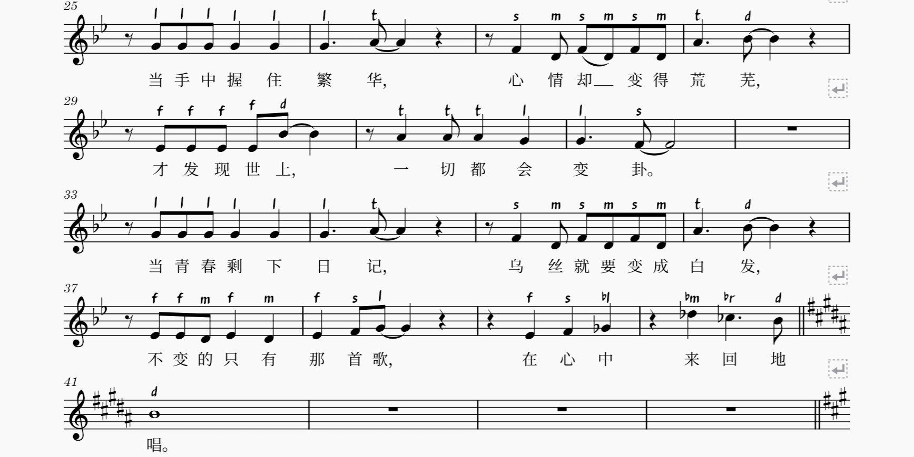
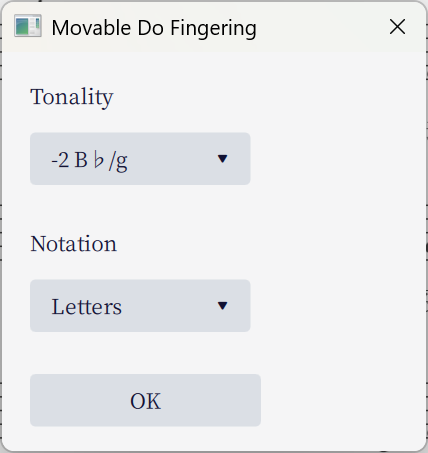

# Movable Do Fingering

> This is a [MuseScore](http://musescore.org/) plugin modified from [nozomu-y/MovableDo](https://github.com/nozomu-y/MovableDo), made to work with MuseScore 3 and 4.
>
> ⚠️ **This branch works only on MuseScore ≤4.3. Check the `mu4.4` branch for MuseScore 4.4 and above.**

When we play Piano, we usually read notes as C, D, E... and we also call them Do, Re, Mi... when try to sing the notes. However, in some circumstances, for example in some chorus, the name Do is not always mapped to C. Instead, it can be mapped to any note based on the tonality. For example, in E♭-major or c-minor tonality, Do is mappped to E♭, and La is mapped to C.

This plugin is similar to the built-in note-names plugin. Instead of the ABC names, it adds DoReMi note names **as fingering texts** based on a given tonality. You can change the appearance of fingering texts in Styles.

## Installation

1. Download the code and unzip it under the user's `Plugins` directory (check MuseScore preferences if you don't know where).
2. Restart MuseScore, and you should be able to activate the plugin in the plugin manager.

Note that the same qml file works in both MuseScore 3 and 4.

## Usage

The process of adding texts is not automatic. You need to run this plugin from the Plugin menu. In MuseScore 4, it is located in the Composing/Arranging Tools submenu. A prompt dialog will pop up.

Click `OK` to apply the texts. Note that this won't remove existing note name texts, so make sure to delete them before applying new ones.

Notes on notation styles:

- **`Letters-vowel`** Use the leading letter of the note name (`Do -> d` `Re -> r`). Include the alternative vowel if the note name contains an accidental (`♯Do -> di` `♭Ti -> ta`).
- **`Letters`** Use the leading letter of the note name (`Do -> d` `Re -> r`) and write the accidentals as-is (`♯Do -> ♯d` `♭Ti -> ♭t`). Recommended for regions that do not use alternative vowels to indicate accidentals.
- **`Numeric`** Use numbers `1, 2, 3...` instead of names `Do, Re, Mi...` and write accidentals as-is. Recommended for regions where Numbered Music Notation (a.k.a. JianPu in Chinese) is commonly used.

## Changes compared to nozomu-y/MovableDo

- Made to work with MuseScore 4.
- Translated text to English.
- Added Letters and Numeric notation styles.
- Reorganized the tonality menu for better readability.
- The note names are now added as **fingering texts** instead of staff texts. This is based on the fact that Movable Do note names are rarely used in circumstances that need fingering texts. Utilizing fingering texts also makes it easier to delete all existing note names and reapply them.
